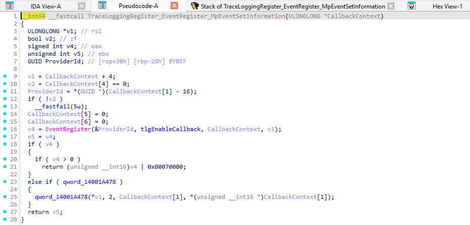
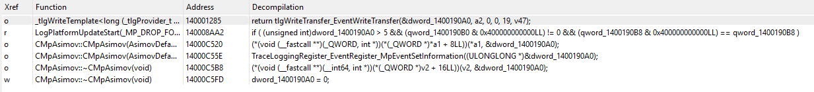
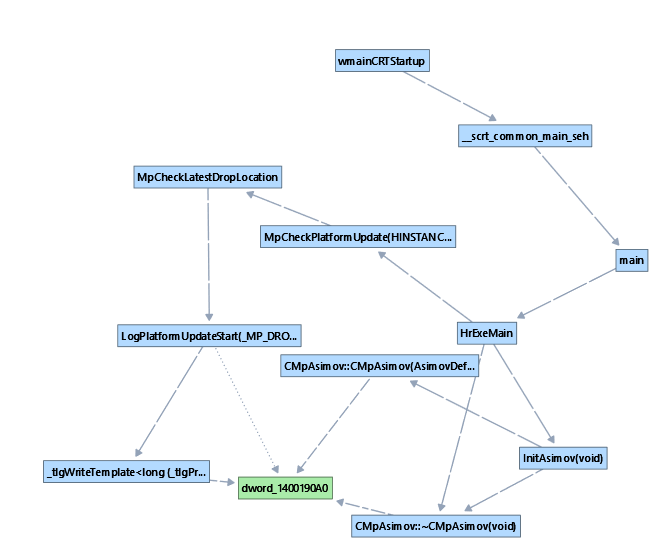

# Reverse Engineering `MsMpEng.exe`

## ETW Analysis Structure


```cpp
__int64 __fastcall TraceLoggingRegister_EventRegister_MpEventSetInformation(ULONGLONG *CallbackContext) { ... }
```

`ULONGLONG *CallbackContext` → `(ULONGLONG *)&dword_1400190A0`

```cpp
TraceLoggingRegister_EventRegister_MpEventSetInformation((ULONGLONG *)&dword_1400190A0);
```

IDA Xref of `dword_1400190A0`:



```cpp
ULONG __fastcall _tlgWriteTemplate<long (_tlgProvider_t const *,void const *,_GUID const *,_GUID const *,unsigned int,_EVENT_DATA_DESCRIPTOR *),&long _tlgWriteTransfer_EventWriteTransfer(_tlgProvider_t const *,void const *,_GUID const *,_GUID const *,unsigned int,_EVENT_DATA_DESCRIPTOR *),_GUID const *,_GUID const *>::Write<_tlgWrapperByVal<8>,_tlgWrapSz<wchar_t>,_tlgWrapSz<wchar_t>,_tlgWrapSz<wchar_t>,_tlgWrapSz<wchar_t>,_tlgWrapSz<wchar_t>,_tlgWrapSz<wchar_t>,_tlgWrapperByVal<4>,_tlgWrapperByVal<4>,_tlgWrapperByVal<4>,_tlgWrapperByVal<4>,_tlgWrapperByVal<4>,_tlgWrapperByVal<4>,_tlgWrapperByVal<4>,_tlgWrapperByVal<4>,_tlgWrapSz<wchar_t>,_tlgWrapSz<wchar_t>>(
    __int64 a1,
    unsigned __int8 *a2,
    __int64 a3,
    __int64 a4,
    __int64 a5,
    void **a6,
    void **a7,
    void **a8,
    void **a9,
    void **a10,
    void **a11,
    __int64 a12,
    __int64 a13,
    __int64 a14,
    __int64 a15,
    __int64 a16,
    __int64 a17,
    __int64 a18,
    __int64 a19,
    void **a20,
    void **a21
) {
    ...
    return tlgWriteTransfer_EventWriteTransfer((__int64)&dword_1400190A0, a2, 0, 0, 0x13u, v47);
}
```

`dword_1400190A0` is likely a TLG (TraceLogging). I can now trace `dword_1400190A0` (TLG). Using IDA's Xref To system to examine functions referencing `dword_1400190A`, the resulting graph is as follows:



```mermaid
main
└── HrExe
    ├── InitAsimov
    │   └── CMpAsimov::~CMpAsimov
    │       └── dword_1400190A0
    │
    └── MpCheckPlatformUpdate
        └── MpCheckLatestDropLocation
            └── LogPlatformUpdateStart
                └── tlgWriteTemplate
                    └── dword_1400190A0
```

`MpCheckPlatformUpdate` appears to be a function for generating events during updates. It seems to check for the latest updates, verify their locations, and then begin logging the update process (based on function name inference).

According to ['Asimov' lets Microsoft track in real-time Windows Threshold usage](https://pureinfotech.com/asimov-track-near-real-time-windows-threshold-usage/), Asimov is a powerful feedback and diagnostic mechanism designed to monitor real‑time usage data from users' computers.

## ETW & Asimov System
(Personal opinion) It appears to be, at least in part, a telemetry collection system similar to EDR. I speculate that it provides telemetry information collected via ETW to the cloud, where an ML or equivalent system analyzes it.

## ETW GUID
`Imports` → `RegisterTraceGuidsW` → `HrExeMain`

```cpp
__int64 __fastcall HrExeMain(__int64 a1, HMODULE a2)
{
  ULONG64 *v2; // rbx
  const GUID **v3; // rdi
  const GUID *v4; // r8
  bool v5; // bp
  int v6; // eax
  unsigned int v7; // edi
  FARPROC ProcAddress; // rax
  signed int LastError; // eax
  _QWORD *v10; // rbx
  TRACEHANDLE v11; // rcx
  struct _TRACE_GUID_REGISTRATION TraceGuidReg; // [rsp+40h] [rbp-28h] BYREF
  HMODULE hModule; // [rsp+78h] [rbp+10h] BYREF

  hModule = a2;
  qword_14001A240 = 1;
  qword_14001A238 = 0;
  v2 = (ULONG64 *)&WPP_MAIN_CB;
  WPP_MAIN_CB = 0;
  WPP_REGISTRATION_GUIDS = (__int64)&WPP_ThisDir_CTLGUID_MsMpEng;
  v3 = (const GUID **)&WPP_REGISTRATION_GUIDS;
  WPP_GLOBAL_Control = &WPP_MAIN_CB;
  do
  {
    v4 = *v3;
    TraceGuidReg.Guid = v4;
    ++v3;
    TraceGuidReg.RegHandle = 0;
    v2[4] = (ULONG64)v4;
    RegisterTraceGuidsW(WppControlCallback, v2, v4, 1u, &TraceGuidReg, 0, 0, v2 + 1);
    v2 = (ULONG64 *)*v2;
  }
  ...
}
```
`&TraceGuidReg.Guid` → `v4` → `*v3` → `WPP_REGISTRATION_GUIDS` → `WPP_ThisDir_CTLGUID_MsMpEng`

```
.rdata:0000000140013F60 WPP_ThisDir_CTLGUID_MsMpEng GUID <2A94554Ch, 2FBEh, 46D0h, <9Fh, 0A6h, 60h, 56h, 22h, 81h, 0B0h, \
.rdata:0000000140013F60                                         ; DATA XREF: HrExeMain+26↑o
.rdata:0000000140013F60                       0CBh>>
```

```c
typedef struct _GUID {
  uint32_t Data1;
  uint16_t Data2;
  uint16_t Data3;
  uint8_t  Data4[8];
} GUID;
```

| Offset    | Bytes                   |
|:----------|:------------------------|
| 0x00      | 4C 55 94 2A             |
| 0x04      | BE 2F                   |
| 0x06      | D0 46                   |
| 0x08      | 9F A6 60 56 22 81 B0 CB |


ETW GUID: `{2A94554C-2FBE-46D0-9FA6-60562281B0CB}`

```ps
PS C:\WINDOWS\system32> Get-EtwTraceProvider "{2A94554C-2FBE-46D0-9FA6-60562281B0CB}"

SessionName     : MpWppTracing-20251224-111713-00000003-fffffffeffffffff
Guid            : {2A94554C-2FBE-46D0-9FA6-60562281B0CB}
Level           : 0 (WINEVENT_LEVEL_LOG_ALWAYS)
MatchAnyKeyword : 0x3
MatchAllKeyword : 0x0
EnableProperty  :
```